# Djodjo's Gallery — Retour d'expérience

**Refondre et sécuriser un site vitrine en neuf jours, avec une IA**

Geoffroy, alias Djodjo · en reconversion vers la cybersécurité (blue team) · octobre 2026

Site : [djos-galley.online](https://djos-galley.online) · Version PDF : [Djodjos-Gallery-retour-experience.pdf](Djodjos-Gallery-retour-experience.pdf)

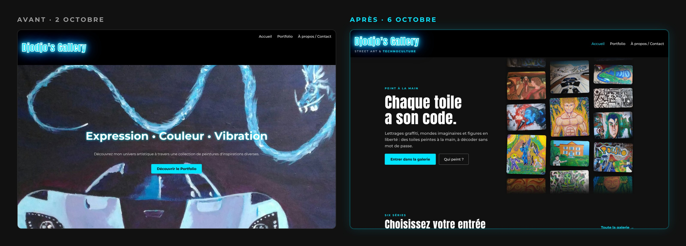

## En bref

Djodjo's Gallery est le site vitrine de mes peintures : street art, lettrages graffiti, personnages, machines. Il ne vend rien. Il me sert aussi de terrain d'entraînement pour ma reconversion vers la cybersécurité.

Du 28 septembre au 6 octobre 2026, le site est passé de fichiers déposés à la main chez l'hébergeur à un projet versionné, déployé automatiquement, durci et relu. Le travail tient en **63 pull requests**, que j'ai toutes relues avant de les fusionner ou de les fermer. Quinze viennent du workflow d'ajout de toiles, deux de Dependabot ; les 46 autres ont été préparées avec **Claude (IA)**, l'assistant d'Anthropic.

| Indicateur | Avant | Après |
|---|---|---|
| Œuvres en ligne | 10, sans classement | 62, en six séries |
| Ajouter une toile | modifier le HTML à la main | déposer une photo, relire une pull request |
| Poids des images de départ (11 fichiers) | 18,9 Mo | 4,4 Mo (−77 %) |
| Galerie sur téléphone (33 toiles) | 13,1 Mo | 2,4 Mo (−82 %) |
| En-têtes de sécurité HTTP | 0 | 6, HSTS d'une semaine, version de PHP masquée |
| Ressources chargées chez un tiers | Google Fonts sur chaque page | aucune |
| Accessibilité | toiles hors d'atteinte au clavier, formulaire sans étiquettes | 0 problème détecté par l'outil axe sur les 4 pages |
| Adresses du site | `www` et adresse principale servies en double | une seule adresse (`301`), page 404 du site |
| Erreurs dans la galerie (3 octobre) | 3 doublons, 1 image cassée | 0 |
| Titre principal (`h1`) | le logo, sur les trois pages | un par page, propre à chaque page |

**Ce que le projet m'a fait pratiquer :** Git et GitHub (branches, pull requests, relecture), GitHub Actions, sécurité web (CSP, HSTS, en-têtes HTTP), sécurité de la chaîne d'approvisionnement, fuites d'information (OWASP WSTG), RGPD, accessibilité (axe, navigation au clavier), référencement (Search Console, redirections), lecture des en-têtes avec `curl`, règles Apache (`.htaccess`), travail encadré avec une IA.

> Le code du site est dans un dépôt privé. Les numéros de pull request (PR) servent de repères ; l'annexe les liste toutes.

## Qui a fait quoi

Le pied de page du site dit « conçu, codé et sécurisé par Djodjo et Claude (IA) ». Voici le partage réel.

| Moi (Geoffroy) | Claude (IA) |
|---|---|
| Objectifs, priorités et direction artistique | Trois revues de code complètes, diagnostics |
| L'idée de « Street art & technoculture », le nom des séries Horizons et Électrons libres | Propositions d'en-tête, maquettes de l'accueil, premiers jets des textes |
| Le choix de la maquette, la correction et la validation de tous les textes | Le code : HTML, CSS, JavaScript, PHP, Python, workflow GitHub Actions |
| La création du dépôt et sa liaison avec l'hébergeur | Les tests avant chaque PR : navigateur automatisé (ordinateur et téléphone), Apache local, outil d'accessibilité axe |
| La relecture et la fusion de chaque pull request | La rédaction des pull requests et de `CLAUDE.md` |
| Les vérifications sur le site en ligne (`curl`, console du navigateur) et Search Console, propriété vérifiée par DNS | Le diagnostic de ce que Google montrait, à partir de ces vérifications |
| Les photos et les titres des toiles, les décisions de consentement, le choix des descriptions Google et de l'image de partage | L'explication de chaque choix et de chaque erreur, les miennes comme les siennes |
| La série Persos, créée seul sans aide au code ; l'en-tête HSTS, trouvé moi-même en exercice guidé | |

## La méthode

1. **Diagnostiquer d'abord** : le code, les textes et les toiles sont relus avant toute proposition.
2. **Montrer avant de coder** : maquettes avec les vraies toiles, captures avant chaque changement visuel.
3. **Écrire les textes à part** : rédigés et validés dans un document partagé, puis intégrés en une seule PR.
4. **Une branche et une pull request par sujet**, testée sur ordinateur et sur téléphone.
5. **Un humain fusionne** : Claude n'a jamais poussé sur la branche principale.
6. **Vérifier en ligne après la fusion** : codes de réponse et en-têtes avec `curl -I`, console du navigateur, Search Console. L'IA travaille dans un environnement isolé qui ne joint pas le site : ces vérifications passent par moi.

**`CLAUDE.md`, la mémoire du projet.** Ce fichier, dans le dépôt, décrit les conventions et les règles de sécurité : aucun secret dans le dépôt, aucune ressource chargée chez un tiers, contraintes de la politique de sécurité du contenu, commentaires publics sans détails internes, tests à faire avant chaque PR. L'IA le relit à chaque session : les garde-fous sont écrits une fois, au lieu d'être répétés à chaque conversation.

**Travailler avec une IA, sans lui donner les clés.** Claude n'accède qu'au dépôt du site, sur autorisation, et ne fusionne rien. Ses propositions passent par la même relecture que n'importe quelle contribution. Ses erreurs figurent dans le tableau des incidents : c'est la relecture qui les a rattrapées.

**L'IA n'est pas illimitée.** Claude s'utilise dans une limite d'usage hebdomadaire : en six jours, j'ai consommé la totalité de la mienne (99 % le 7 octobre). D'où trois habitudes pour l'économiser : une conversation par sujet, un résumé de l'état du site pour reprendre dans une nouvelle conversation sans tout relire, et des captures recadrées plutôt que des pages entières.

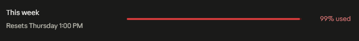

## Quatre temps

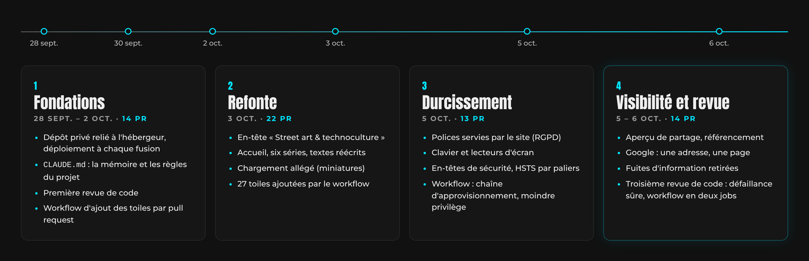

### 1. Fondations (28 septembre – 2 octobre, PR #1 à #14)

**Un dépôt et un déploiement sûrs.** Le dépôt GitHub est privé : le site reste public, mais le code, l'historique et une éventuelle erreur de commit ne le sont pas. L'hébergeur est relié par OAuth à ce seul dépôt, pas au compte entier, et redéploie le site à chaque fusion sur la branche principale. Le formulaire de contact lit ses identifiants dans un fichier placé hors de la racine web, et aucun fichier privé n'est suivi par Git.

**`CLAUDE.md`** (PR #5) : voir « La méthode ».

**Première revue de code** (PR #6 à #11) :

- galerie cassée sur les téléphones de moins de 370 px de large : le script calculait zéro colonne et empilait toutes les toiles ;
- images allégées de 18,9 à 4,4 Mo, sans différence visible ;
- page par défaut de l'hébergeur supprimée ;
- code tiers et fichiers cachés bloqués côté serveur, liste des dossiers désactivée, trois premiers en-têtes de sécurité ;
- formulaire de contact protégé par un champ piège anti-robots et une limite d'envois.

**Le workflow d'ajout de toiles** (PR #12). Ajouter une toile demandait de modifier le HTML à la main. Une galerie listée automatiquement en PHP a été envisagée ; j'ai préféré garder un site statique et un humain avant chaque publication. Une photo déposée dans un dossier déclenche un workflow GitHub Actions, qui la traite et ouvre une pull request.

### 2. Refonte (3 octobre, PR #15 à #36)

**L'en-tête** (PR #19). « Artiste peintre » est un intitulé de métier, et la peinture n'est pas le métier que je vise. « Street art & technoculture » décrit le travail : le mot parle à la fois des machines peintes et de la carrière tech. Il s'écrit en un seul mot et en minuscule : avec un espace, on lirait « culture techno », la musique.

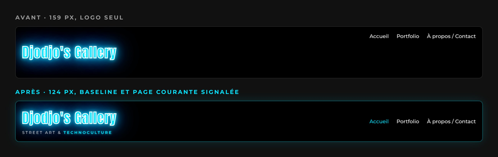

**L'accueil** (PR #24 à #27). D'une bannière fixe à une page qui raconte : l'accroche « Chaque toile a son code. », un mur de toiles qui défilent, les cartes des séries, un zoom sur une toile, la bio, le contact. Les voitures restent au second plan, et aucun nombre de toiles n'est affiché, car il deviendrait faux à chaque ajout.

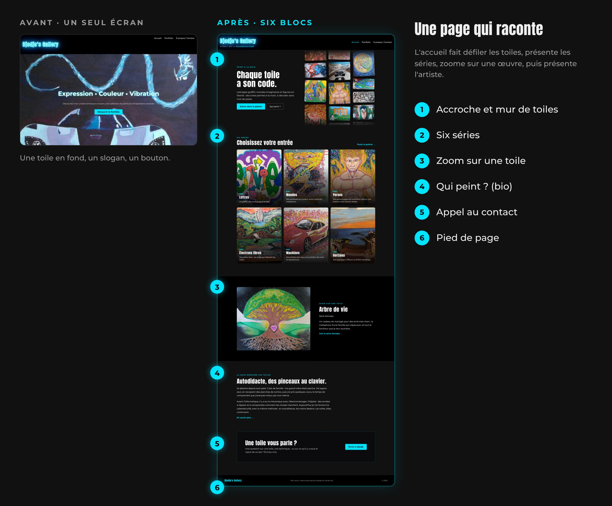

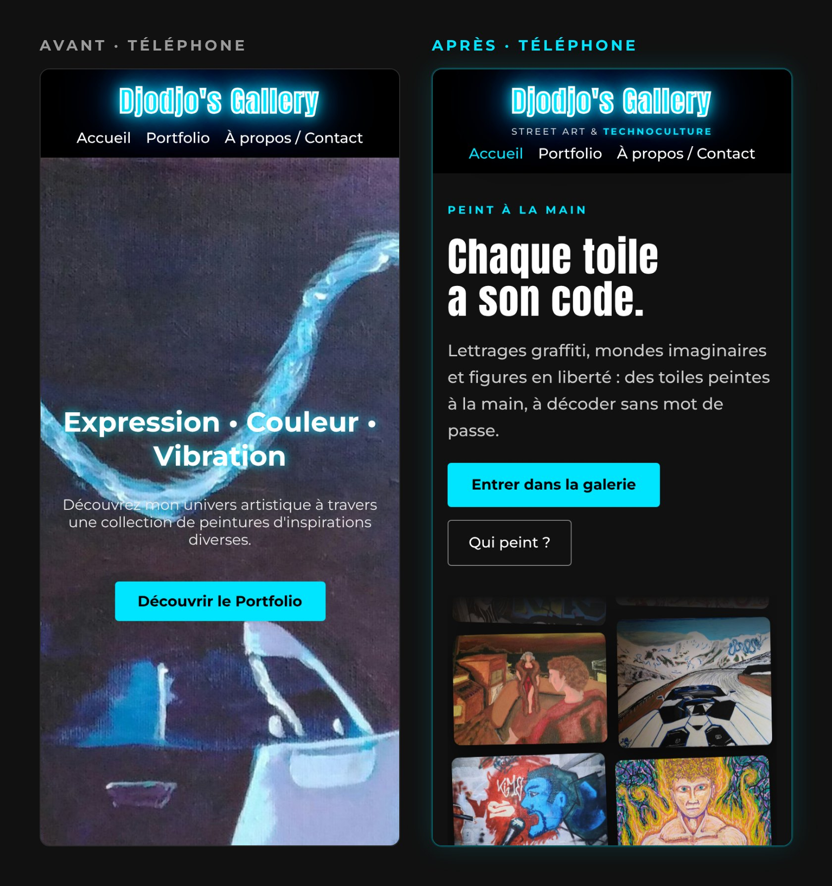

**Les séries** (PR #22 et #23). Six séries, chacune avec son filtre et sa propre adresse (`portfolio.html#mondes`). La série est portée par le HTML de chaque toile, et la liste des séries n'existe qu'à un seul endroit, que le workflow relit : une série s'ajoute sans toucher au code. Je l'ai vérifié en créant seul la série Persos.

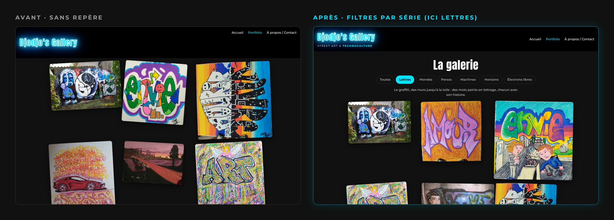

**Les textes** (PR #36). Tous réécrits dans un document partagé, corrigés et validés, puis intégrés en une seule PR : un `h1` par page, une phrase par série, une description pour Google par page, et pour chaque toile une description de ce qu'on voit, distincte de son titre.

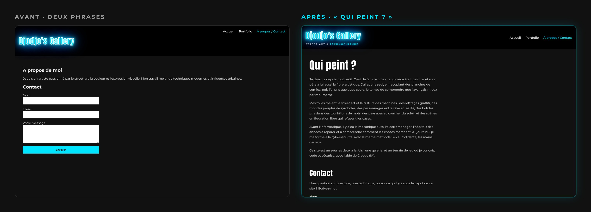

**Le chargement** (PR #29 à #31). Des miniatures de 640 px avec `srcset` : le navigateur prend la plus petite image qui suffit. Les pages HTML sont revérifiées à chaque visite (`Cache-Control: no-cache`).

### 3. Durcissement (5 octobre, PR #37 à #49)

**Données personnelles (RGPD)** (PR #37). Les polices venaient de Google Fonts : chaque visite envoyait l'adresse IP du visiteur à Google, sans son accord. Elles sont maintenant servies par le site. Plus aucune ressource n'est chargée chez un tiers, et `CLAUDE.md` l'interdit pour la suite.

**Accessibilité** (PR #38). L'outil axe et des tests au clavier ont révélé trois problèmes : la touche Tab sautait toutes les toiles, la visionneuse n'avait pas de bouton de fermeture, et les champs du formulaire n'avaient pas d'étiquette. Chaque toile est maintenant un bouton, et la visionneuse est une vraie fenêtre de dialogue. Le focus va sur « Fermer », reste dans la fenêtre, puis revient sur la toile à la fermeture. Au passage, une adresse mal formée qui cassait la galerie retombe maintenant sur « toutes les séries ».

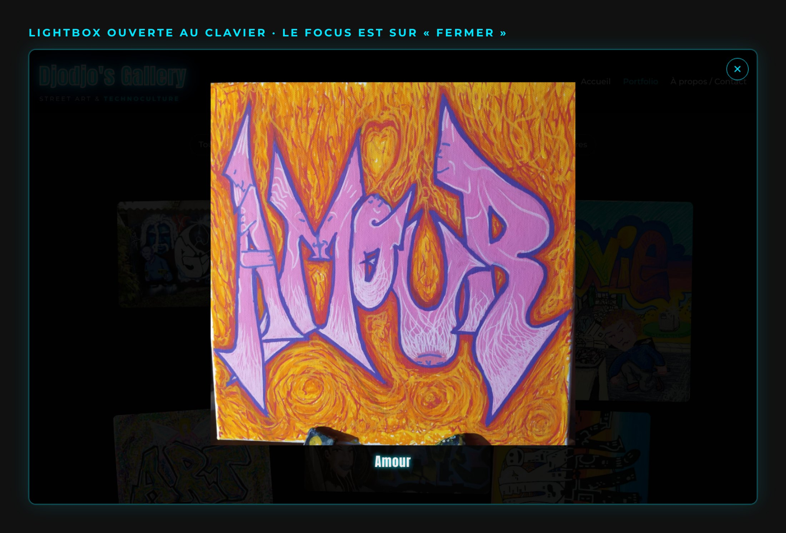

**En-têtes de sécurité** (PR #39). Une politique de sécurité du contenu stricte : la page ne charge que des fichiers du site lui-même, et un script injecté serait bloqué par le navigateur. S'y ajoutent `Permissions-Policy`, qui refuse caméra, micro et position, et le retrait de `X-Powered-By`, qui annonçait la version de PHP.

**HSTS, par paliers** (PR #40). Cet en-tête oblige le navigateur à rester en HTTPS. Mal réglé, il peut rendre un site inaccessible pendant toute sa durée. Il a donc commencé à 60 secondes, est passé à une semaine le 6 octobre (PR #54), et s'allongera encore par paliers (un mois, puis un an), avec une vérification à chaque étape. J'ai trouvé la ligne moi-même, en exercice guidé.

**Workflow sécurisé** (PR #41, #42 et #49). Le workflow ouvre des fichiers venus de l'extérieur et peut écrire dans le dépôt : il méritait le même soin qu'un serveur. Les actions sont désignées par l'empreinte d'un commit plutôt que par une étiquette déplaçable, les modules Python sont vérifiés par empreinte, et Dependabot propose les mises à jour, que je relis avant de fusionner (PR #49). Le jeton d'écriture n'est donné qu'à la dernière étape. La PR #41, ouverte exprès puis fermée, a prouvé en conditions réelles que ce jeton limité suffisait.

**Remplacer une toile sans piège de cache** (PR #48). Une image remplacée sous le même nom peut rester ancienne pendant une semaine chez les visiteurs, à cause du cache de l'hébergeur. Le workflow remplace maintenant une toile sous un nouveau nom, et met à jour la galerie et l'accueil.

Le même jour, 25 toiles ont rejoint la galerie (PR #43 et #46).

### 4. Visibilité et revue de code (5 – 6 octobre, PR #50 à #63)

**Partage et référencement** (PR #50 et #51). Un lien du site collé dans WhatsApp, LinkedIn ou Discord affiche maintenant un aperçu : titre, description et image (balises Open Graph). Chaque page déclare son adresse de référence (`canonical`), et le site a ses icônes, des données structurées pour Google, un `robots.txt` et un `sitemap.xml`. Sur ordinateur, WhatsApp ne montre qu'une vignette carrée découpée au centre de l'image : la composition est donc symétrique, le logo au milieu, et les quatre toiles entrent dans ce carré. J'ai choisi cette version parmi plusieurs variantes.

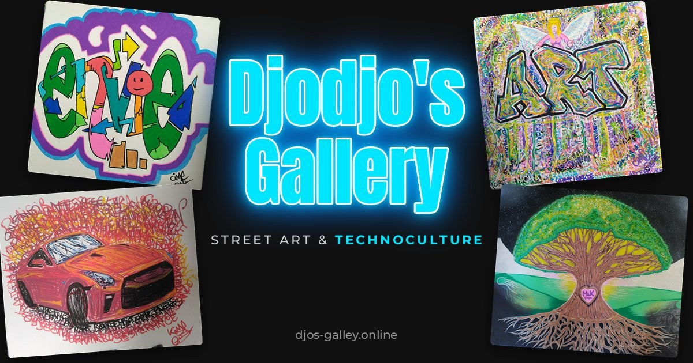

**Ce que Google montrait encore** (PR #54 et #55). Une recherche « djos gallery » affichait toujours l'ancien titre « Artiste Peintre – Accueil ». Le diagnostic, fait avec `curl -I` et Search Console : l'adresse `www` et l'adresse principale répondaient toutes les deux `200` avec la même page, et Google gardait une vieille copie de la version `www`. La balise `canonical` n'est qu'une suggestion ; une redirection `301` de `www` vers l'adresse principale est un ordre. La même PR ajoute une vraie page 404, qui garde son code d'erreur (sinon Google croirait que l'adresse existe), et passe HSTS à une semaine. Le passage de `http` à `https` est déjà fait par le CDN de l'hébergeur : une règle de plus dans `.htaccess` aurait pu faire tourner le site en boucle. Enfin, les descriptions commencent maintenant par « street art », les mots qu'on cherche vraiment.

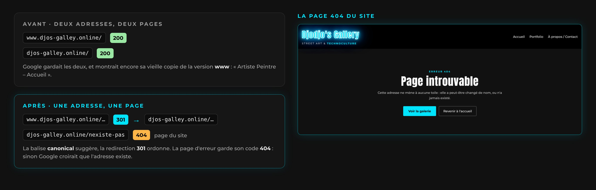

**Ce que le site disait de lui-même** (PR #52 et #53). Tout le monde peut lire les fichiers publics, et `robots.txt` est souvent le premier qu'on ouvre pour reconnaître un site (OWASP WSTG-INFO-03). Son commentaire citait les dossiers internes, alors qu'il disait justement ne pas les citer (erreur de Claude, dans la PR #50). Les commentaires du HTML et du CSS nommaient le fichier de règles du projet, le workflow et la protection du formulaire. Ce n'étaient pas des failles, puisque ces dossiers répondent `403`, mais des informations gratuites. Tout est retiré, et `CLAUDE.md` pose la règle : les commentaires publics expliquent la mise en page, jamais l'intérieur du site.

**Troisième revue de code** (PR #56 et #58). Tout le code a été relu, sauf le code tiers. Sur les sept points relevés, trois sont corrigés.

- **`.htaccess` en défaillance ouverte** (PR #56). Les protections étaient rangées dans des blocs `<IfModule>` : si un module manque, Apache ignore ces règles sans rien dire. Démonstration sur un Apache local, sans le module de réécriture : `.git/config`, `CLAUDE.md` et le workflow répondaient `200`, et le contrôle de syntaxe répondait « Syntax OK ». Hors de ces blocs, un module manquant donne une erreur 500 visible, et rien ne fuit. Vérifié en ligne le 6 octobre : les pages répondent normalement, et les fichiers internes `403`.
- **Le jeton d'écriture n'est plus sur la machine qui ouvre les photos** (PR #58). Le workflow tourne désormais en deux jobs, sur deux machines. Le premier traite les photos avec un jeton en lecture seule. Le second ne lance ni Python ni la bibliothèque d'images : il contrôle le résultat du premier (fichiers autorisés seulement, aucun lien symbolique ni fichier exécutable), puis ouvre la pull request. Au passage, les liens symboliques sont refusés : un lien vers une image déjà en ligne était accepté comme une nouvelle toile.
- **PHPMailer suivi** (PR #58). C'est le seul code tiers exécuté par le site, et rien ne le surveillait. `composer.lock` décrit maintenant exactement la version installée.

Les quatre autres points seront décrits ici une fois corrigés : on ne publie pas une faiblesse encore ouverte.

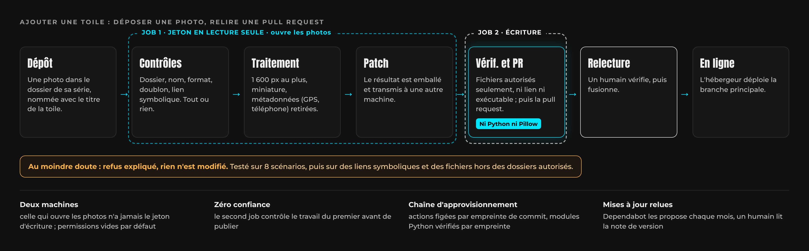

Le nouveau workflow a été testé sur une branche jetable (PR #57, fermée), puis en conditions réelles : les quatre dépôts de photos suivants (PR #60 à #63) sont passés par les deux jobs sans erreur. La galerie compte maintenant 62 œuvres, dont plusieurs graffitis sur mur.

**403 plutôt que 404.** Faut-il cacher les dossiers internes derrière une erreur 404, pour ne pas confirmer qu'ils existent ? La réponse reste 403 : le gain serait de l'obscurité, pas de la protection. Et côté blue team, une 403 sur `/.git/` dans les journaux du serveur est un signal clair de reconnaissance, qui se noierait parmi les liens cassés.

## Incidents et leçons

| Incident | Cause | Ce que j'en retiens |
|---|---|---|
| Une image remplacée revient dans son ancienne version (28 septembre, puis 5 octobre) | Même nom de fichier ; le cache de l'hébergeur garde l'image une semaine | La leçon du premier jour avait été oubliée. Le workflow l'applique maintenant (PR #48) |
| Doublons et image cassée dans la galerie | J'ai écarté la correction prête dans la PR #18 pour réparer à la main, directement sur la branche principale | Une correction relue et testée vaut mieux qu'une réparation à la main. Le fichier, sa miniature et sa ligne vont ensemble |
| Des prénoms publiés dans un texte de l'accueil | PR fusionnée sans relecture | Retirés à la PR suivante, six minutes plus tard, mais ils restent dans l'historique. Relire avant de fusionner ; ne publier que le nécessaire |
| Deux toiles représentant des personnes réelles, titrées par leur prénom ou surnom | Publiées avant d'avoir l'accord des personnes | L'une retirée, l'autre renommée. Utiliser le portrait de quelqu'un demande son accord ; publier est irréversible |
| Une PR décrivait un comportement faux (erreur de Claude) | Description non vérifiée | Corrigé par la PR #16 : relire aussi ce que l'IA affirme |
| Deux correctifs sur téléphone sans effet (erreur de Claude) | Corrections sur hypothèse, sans mesure sur l'appareil | Problème encore ouvert : mesurer avant de corriger |
| Maquettes perdues dans l'éditeur (erreur de Claude) | Une réorganisation a fait planter l'outil | Toujours fournir une version image d'une maquette |
| Conflits de fusion en série | Mon éditeur reformatait tout le fichier à chaque sauvegarde | Formater quand on le décide ; récupérer la dernière version avant de modifier |
| Fusions avant test ou relecture | PR #31 fusionnée avant le test sur téléphone, PR #33 avant la relecture des titres | Une PR ouverte ne coûte rien, une erreur en ligne si |
| Carte de l'accueil cassée | Deux toiles retirées directement sur la branche principale, sans mettre à jour l'accueil | Tout passe par une PR, sauf le dépôt de photos |
| Pull request d'ajout en double (erreur de Claude) | Une PR touchant le dossier d'ajout a relancé le workflow alors que des photos attendaient | Faire attendre le workflow quand une PR d'ajout est déjà ouverte (à faire) |
| `robots.txt` citait les dossiers internes (erreur de Claude) | Un commentaire écrit pour expliquer, dans un fichier public | Corrigé par la PR #52 : un fichier public ne décrit jamais l'intérieur du site |
| Google montrait encore l'ancien site | `www` et l'adresse principale servaient la même page en `200` depuis le début | Une adresse, une page : la redirection `301` ordonne, la balise `canonical` suggère (PR #54) |
| Trois constats faux dans la revue de code (erreur de Claude) | Une commande qui n'affichait qu'une partie d'un fichier, des caractères comptés en octets, un choix pris pour une erreur | Vérifier un constat avant de le corriger |

## Réflexes cyber appliqués

| Réflexe | Dans ce projet |
|---|---|
| Moindre privilège | Hébergeur relié à un seul dépôt ; workflow en deux jobs : la machine qui ouvre les photos n'a jamais le jeton d'écriture, permissions vides par défaut |
| Zéro confiance | Le second job contrôle le travail du premier avant de publier : fichiers autorisés seulement, ni lien symbolique ni exécutable |
| Sécurité de la chaîne d'approvisionnement | Actions figées par empreinte, modules vérifiés par empreinte, mises à jour relues avant fusion ; PHPMailer suivi par `composer.lock` |
| Gestion des changements | Une branche et une PR par sujet, relue par un humain ; 63 PR en neuf jours |
| Validation des entrées, tout ou rien | Le workflow refuse tout dépôt douteux sans rien modifier, liens symboliques compris |
| Limiter les fuites d'information | `robots.txt` et commentaires publics sans détails internes ; version de PHP masquée |
| Minimisation des données | Métadonnées des photos retirées (téléphone, date, GPS) ; photos brutes inaccessibles depuis le web ; polices servies localement |
| Défense en profondeur | Politique de sécurité du contenu, en-têtes de sécurité, code tiers et fichiers internes bloqués, page par défaut supprimée |
| Défaillance sûre | Protections serveur hors des blocs `<IfModule>` : une panne se voit au lieu de laisser fuir. Galerie illisible : le mur se masque |
| Penser à la détection | `403` gardé sur les dossiers internes : une tentative de reconnaissance reste lisible dans les journaux |
| Changement prudent | HSTS par paliers : 60 secondes, puis une semaine, avec vérification en ligne à chaque étape |
| Secrets hors du dépôt | Identifiants du formulaire hors de la racine web et hors du dépôt, lui-même privé |
| Tester avant la production | Règles serveur testées sur un Apache local, y compris avec un module coupé ; workflow testé sur une branche jetable |
| Lire les en-têtes HTTP | `curl -I` pour vérifier une mise en ligne, suivre une redirection, repérer le CDN de l'hébergeur et mesurer son temps de réponse |
| Transparence | Usage de l'IA affiché sur le site ; erreurs de l'IA listées ici comme les autres |

## La suite

- **Toiles noires sur Android** jusqu'au premier défilement : mesurer sur l'appareil (débogage USB, onglet Réseau) avant tout nouveau correctif.
- **Poids des pages** : sur un écran haute définition, la miniature de 640 px est trop petite et la galerie charge les images complètes, près de 28 Mo pour 62 œuvres. Il faut une taille intermédiaire. L'accueil, lui, charge toutes les miniatures pour son mur (5,6 Mo) : il faut en limiter le nombre.
- **Les dernières toiles** : leur écrire une description (texte alternatif) et un vrai titre, là où il ressemble encore à un nom de fichier.
- **Les points restants de la revue de code**, puis leur description ici.
- **HSTS** : un mois, puis un an, après vérification à chaque palier.
- **Le reste** : pied de page sur toutes les pages, ménage des branches obsolètes, et une page « Sous le capot » qui expliquera les principes de sécurité du site, jamais ses réglages, avec un fichier `security.txt`.

Me contacter : par le [formulaire du site](https://djos-galley.online/about.html).

## Annexe : les 63 pull requests

Afficher la liste

| PR | Date | Sujet | Résultat |
|---|---|---|---|
| #1 | 28/09 | Renomme peinture1.jpg en envie.jpg | fusionnée |
| #2 | 28/09 | Renomme les peintures 2 à 10 d'après leur titre | fusionnée |
| #3 | 28/09 | Supprime la barre de défilement de la page d'accueil | fusionnée |
| #4 | 28/09 | Adapte l'accueil et le menu aux petits écrans | fusionnée |
| #5 | 30/09 | Ajoute un CLAUDE.md | fusionnée |
| #6 | 02/10 | Corrige la galerie sur mobile et sous le menu | fusionnée |
| #7 | 02/10 | Remplace les photos par des versions optimisées | fusionnée |
| #8 | 02/10 | Supprime la page par défaut d'Hostinger | fusionnée |
| #9 | 02/10 | Sécurise le dossier vendor et le formulaire de contact | fusionnée |
| #10 | 02/10 | Nettoie la feuille de style et le script | fusionnée |
| #11 | 02/10 | Fait du logo un lien vers l'accueil | fusionnée |
| #12 | 02/10 | Ajoute un workflow qui publie les peintures déposées dans img-add | fusionnée |
| #13 | 02/10 | Ajoute la peinture « Grafity » | fusionnée |
| #14 | 02/10 | Affiche le titre des peintures au survol et dans la lightbox | fusionnée |
| #15 | 03/10 | Ajoute 4 peintures | fusionnée |
| #16 | 03/10 | Mélange l'ordre des peintures à chaque visite | fusionnée |
| #17 | 03/10 | Affiche la galerie sur deux colonnes sur téléphone | fusionnée |
| #18 | — | Corrige les dimensions de quatre peintures dans la galerie | fermée sans fusion |
| #19 | 03/10 | Remplace « Artiste Peintre » par « Street art & technoculture » dans l'en-tête | fusionnée |
| #20 | 03/10 | Ajoute 4 peintures | fusionnée |
| #21 | 03/10 | Retire les quatre anciennes lignes de la galerie aux mauvaises dimensions | fusionnée |
| #22 | 03/10 | Ajoute les séries à la galerie et au workflow d'ajout | fusionnée |
| #23 | 03/10 | Range Vivre-Mourir dans Lettres et Essai dans Électrons libres | fusionnée |
| #24 | 03/10 | Refait l'accueil : mur de toiles, séries, zoom et bio (fusion 1) | fusionnée |
| #25 | 03/10 | Raconte l'histoire d'Arbre de vie dans le zoom de l'accueil | fusionnée |
| #26 | 03/10 | Retire les prénoms et resserre le texte du zoom sur Arbre de vie | fusionnée |
| #27 | 03/10 | Crédite Claude dans le pied de page de l'accueil | fusionnée |
| #28 | 03/10 | Ajoute 3 peintures | fusionnée |
| #29 | 03/10 | Accélère le chargement de la galerie avec des miniatures | fusionnée |
| #30 | 03/10 | Accélère l'affichage de la galerie sur téléphone | fusionnée |
| #31 | 03/10 | Place les peintures de la galerie sans animation | fusionnée |
| #32 | 03/10 | Ajoute 6 peintures | fusionnée |
| #33 | 03/10 | Ajoute 9 peintures | fusionnée |
| #34 | 03/10 | Ajoute la peinture « Space » | fusionnée |
| #35 | 03/10 | Retire une toile et en renomme une autre, faute d'accord des personnes représentées | fusionnée |
| #36 | 03/10 | Intègre les textes validés du site | fusionnée |
| #37 | 05/10 | Héberge les polices sur le site au lieu de Google Fonts | fusionnée |
| #38 | 05/10 | Rend la galerie et le formulaire accessibles, et corrige le lien piégé | fusionnée |
| #39 | 05/10 | Ajoute une politique de sécurité du contenu et masque la version de PHP | fusionnée |
| #40 | 05/10 | Oblige le navigateur à rester en HTTPS (HSTS), d'abord pour 60 secondes | fusionnée |
| #41 | — | Ajoute la peinture « Essai workflow » | fermée sans fusion |
| #42 | 05/10 | Sécurise le workflow d'ajout et garde le profil couleur des photos | fusionnée |
| #43 | 05/10 | Ajoute 6 peintures | fusionnée |
| #44 | — | Ajoute 6 peintures | fermée sans fusion |
| #45 | — | Workflow: Bump the actions group with 2 updates (Dependabot) | fermée sans fusion |
| #46 | 05/10 | Ajoute 19 peintures et remplace la photo de Taï Ji | fusionnée |
| #47 | 05/10 | Remplace la photo de Forum et vide img-add des photos déjà en ligne | fusionnée |
| #48 | 05/10 | Ajoute le remplacement automatique d'une peinture | fusionnée |
| #49 | 05/10 | Workflow: Bump the actions group with 2 updates (Dependabot) | fusionnée |
| #50 | 05/10 | Ajoute l'aperçu de partage et les bases du référencement | fusionnée |
| #51 | 05/10 | Passe l'aperçu de partage à une composition symétrique | fusionnée |
| #52 | 06/10 | Retire le commentaire de robots.txt | fusionnée |
| #53 | 06/10 | Retire des commentaires publics les indices sur l'intérieur du site | fusionnée |
| #54 | 06/10 | Redirige www vers le domaine principal, HSTS une semaine, page 404 | fusionnée |
| #55 | 06/10 | Remplace « peintre autodidacte » par « street art » dans les descriptions | fusionnée |
| #56 | 06/10 | Sort les règles du .htaccess des blocs IfModule (défaillance sûre) | fusionnée |
| #57 | — | Ajoute la peinture « Essai deux jobs » et remplace la photo de « Taï Ji » | fermée sans fusion |
| #58 | 06/10 | Workflow en deux jobs, liens symboliques refusés, suivi de PHPMailer | fusionnée |
| #59 | 06/10 | Garde « figuration libre » dans les textes (règle dans CLAUDE.md) | fusionnée |
| #60 | 06/10 | Ajoute la peinture « Kime-1 » | fusionnée |
| #61 | 06/10 | Ajoute 3 peintures | fusionnée |
| #62 | 06/10 | Ajoute la peinture « fresque-1 » | fusionnée |
| #63 | 06/10 | Ajoute la peinture « fresque-2 » | fusionnée |

